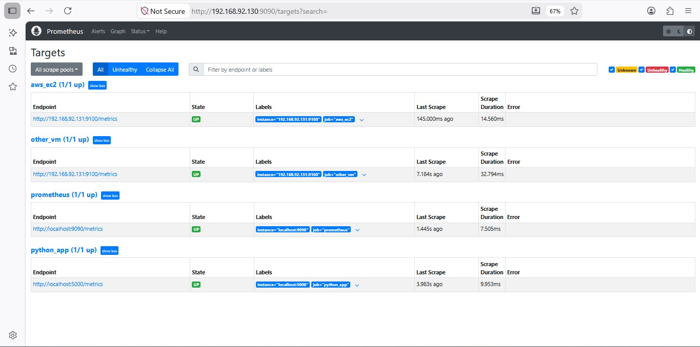

# 📊 Prometheus Comprehensive Monitoring Lab


## 📝 Project Overview
This repository documents a complete, from-scratch deployment of a **Prometheus Monitoring Stack** on **CentOS 9**. The lab demonstrates configuring Prometheus to monitor multiple environments, including bare-metal servers, simulated cloud instances (AWS EC2), and a custom Python web application exporting its own metrics.

## 🏗️ System Architecture
The architecture follows a standard **Pull-Based Monitoring Model**. The central Prometheus server connects to various endpoints at regular intervals to scrape metrics:

1. **Prometheus Server (CentOS 9):** Acts as the core monitoring engine and time-series database.
2. **Targets (Data Sources):**
   * **`localhost:9090`** ➔ Scrapes internal Prometheus metrics.
   * **`localhost:5000`** ➔ Scrapes custom metrics (`app_requests_total`) from the local Python Flask application.
   * **`192.168.x.x:9100`** ➔ Scrapes hardware and OS-level metrics via `Node Exporter` installed on the secondary VM (simulating both local VM and AWS EC2 instances).

## 📂 Repository Structure
```text
📦 prometheus-monitoring-lab
 ┣ 📂 screenshots
 ┃ ┗ 📜 all-targets-up.png       # Output evidence of successful configuration
 ┣ 📜 prometheus.yml             # Main Prometheus configuration file
 ┣ 📜 python-app.py              # Custom Flask application exposing metrics
 ┣ 📜 python-app.service         # Systemd service unit for the Python app
 ┗ 📜 README.md                  # Project documentation
```
## 📸 Lab Output & Proof of Work

Here is the Prometheus dashboard confirming all target environments and services are successfully monitored and **UP**:

<p align="center">
  
</p>

## 🚀 Key Highlights & Implementations
* **Production-Ready Services (`systemd`)**: Created custom `.service` files for Prometheus, Node Exporter, and the Python application to ensure high availability and auto-restart capabilities.
* **Security & Firewall**: Configured `firewalld` correctly to expose necessary TCP ports (`9090`, `9100`, `5000`) while keeping the system secure.
* **Troubleshooting & Debugging**: Successfully diagnosed and resolved `connection refused` and `no such host` errors by fixing static IPs, adjusting localhost targeting, and ensuring services were actively listening on the correct endpoints.

```
Architected by: Ahmed Mohamed Abbas Bahij
Cloud Infrastructure Engineer
